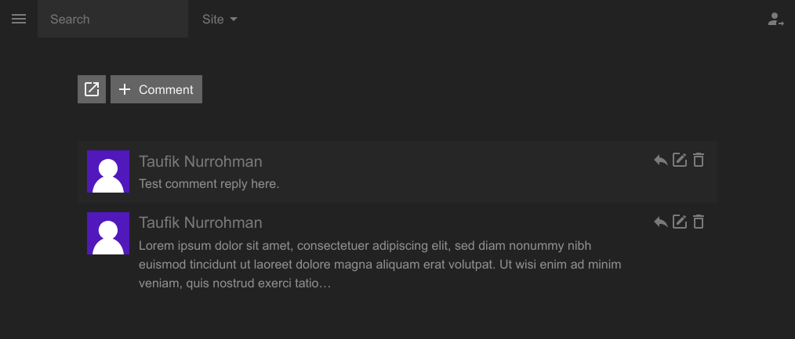

Panel Comment Extension for Mecha’s [Panel](https://github.com/mecha-cms/x.panel)
=================================================================================

This extension adds features to the control panel to make it easier to manage comment files.

Without this extension, the comment menu icon and comments page will look very generic like the assets page:

With this extension, the comments page will look like this:

You can reply to a comment and even create a new comment directly from the panel!

A comments icon will appear on the pages page to take you to the comments folder associated with that page:

